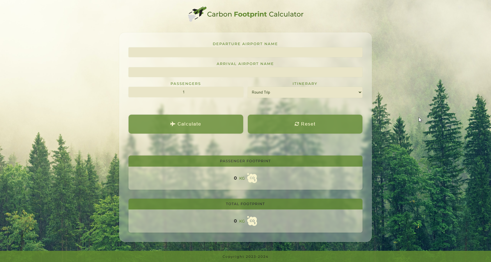

# Carbon Footprint Calculator

## Description

This project is a React web application that provides users with an interface to calculate the carbon footprint of their air travel. It fetches airport data and computes emissions based on various user inputs.

## Features

- **Airport Input:** Users can input the departure and arrival airport names. The application suggests names based on the input, fetching from a pre-fetched list of airport data.
- **Passenger Input:** Users can specify the number of passengers.
- **Travel Itinerary:** Users can select either "One Way" or "Round Trip".
- **Fetching Airport Data:** The app fetches airport data and stores it in a state.
- **Dynamic Suggestions:** As the user types in the airport name, suggestions are dynamically generated and displayed. It also corrects common non-standard characters in airport names.

## Technology

  
 
  
  

## Demo

To see a live demo of the Carbon Footprint Calculator, visit:
[Demo](https://www.massidev.com/portfolio/carbon-footprint-calculator/)

## Installation

To run the Carbon Footprint Calculator locally, follow these steps:

1. Clone the repository: `git clone https://github.com/massi-17/carbon-footprint-calculator .git`
2. Navigate to the project directory: `cd carbon-footprint-calculator `
3. Open the `index.html` file in your preferred web browser.

## Contributing

Contributions are welcome! If you want to contribute to this Carbon Footprint Calculator, please follow these steps:

1. Fork the repository.
2. Create a new branch: `git checkout -b feature/your-feature`.
3. Make your changes and commit them: `git commit -m 'Add your feature'`.
4. Push to the branch: `git push origin feature/your-feature`.
5. Submit a pull request.
